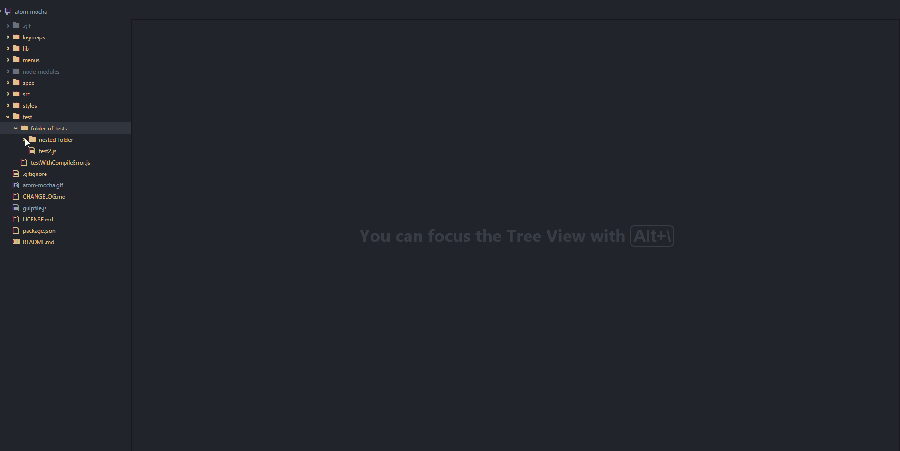

# atom-mocha package

Me: atom-mocha is a plugin for running tests with mocha, from atom.

You: I kinda' figured that out, thx Captain Obvious.

Me: But how you ask?!?!?!

You: No I didn't.

Me: Good questions.

Here's a nice gif of how it works.

# Features

- Can run tests from just about anywhere
    - context menu on .js files (Run Test)
    - context menu on folder (Run Tests)
    - CTRL + SHIFT + T (Run Test - Current File)
    - CTRL + SHIFT + R (Re-run last test)
- Navigate to source from stack trace (click on the trace item)
- Tree view of tests
- Nice little stats view (in the top right corner) with elapsed time and number of passed/failed/pending tests

You: hmm, not bad.
